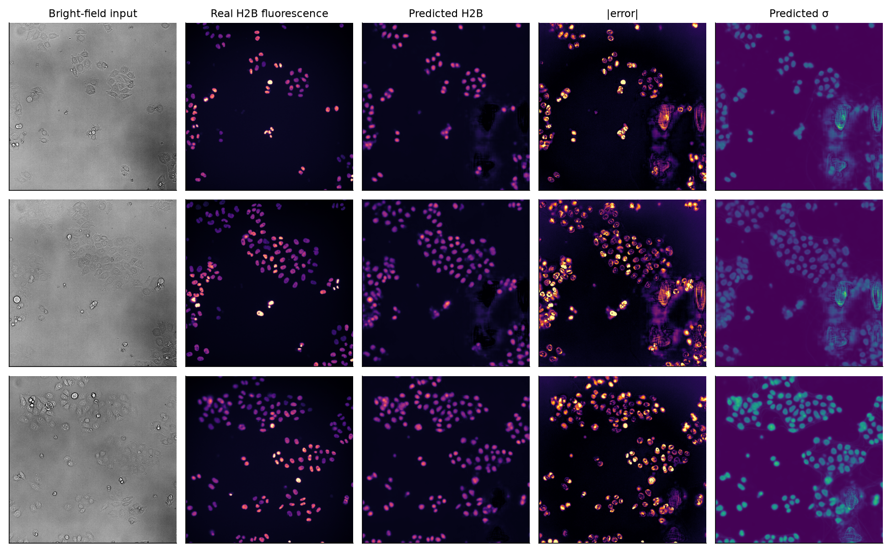

# ChipStain — label-free nuclear staining with an uncertainty you can check

**Category: Model & Algorithm** · Team **Hack2Publish** · Entry for [AI4S Open Innovation: AI for Life Science](https://www.kaggle.com/competitions/ai-4-s-open-innovation-artificial-intelligence-for-life-scien) (AI + Organ-on-a-Chip, 5th Pazhou Algorithm Competition)

ChipStain predicts the **nuclear fluorescence channel (H2B) from a plain bright-field image** and, with it, a **per-pixel uncertainty σ** that marks where the prediction should not be trusted. On an organ-on-a-chip, a label-free nuclear channel avoids fixation (one chip per time-point), phototoxic live DNA dyes and engineered reporter lines — but only if the user can tell when the prediction is wrong. This repository contains the model, every experiment behind the [technical report](report/ChipStain_Technical_Report.pdf), and an honest account of what the uncertainty does and does not achieve.

<p align="center"></p>

## Results at a glance

Held-out well R05-C03 (125 images), **mean ± s.d. over 3 training seeds**:

| Model | Pearson r ↑ | SSIM ↑ | MAE ↓ | PSNR ↑ | seg-F1 ↑ | ρ(σ, err) ↑ | AUSE ↓ | MAE drop, top-20 % σ removed ↑ |
|---|---|---|---|---|---|---|---|---|
| Scratch U-Net (L1, lr 1e-3) | 0.749 ± 0.027 | 0.826 ± 0.003 | 0.0299 ± 0.0006 | 24.15 ± 0.24 | 0.648 ± 0.089 | — | — | — |
| ImageNet-L1 U-Net (L1, lr 5e-4) | 0.755 ± 0.005 | 0.823 ± 0.005 | 0.0296 ± 0.0003 | 24.25 ± 0.07 | 0.669 ± 0.021 | — | — | — |
| Scratch U-Net + TTA (σ = view s.d.) | 0.764 ± 0.024 | 0.831 ± 0.003 | 0.0294 ± 0.0006 | 24.36 ± 0.25 | 0.665 ± 0.083 | 0.283 ± 0.071 | 0.258 ± 0.025 | 40.5 ± 3.2 % |
| ImageNet-L1 U-Net + TTA (σ = view s.d.) — matched control | 0.768 ± 0.006 | 0.827 ± 0.005 | 0.0291 ± 0.0003 | 24.47 ± 0.10 | 0.690 ± 0.019 | 0.317 ± 0.037 | 0.248 ± 0.011 | 42.9 ± 1.8 % |
| ChipStain (β-NLL, β = 0.5) | 0.757 ± 0.015 | 0.810 ± 0.018 | 0.0324 ± 0.0013 | 23.92 ± 0.36 | 0.697 ± 0.012 | 0.430 ± 0.006 | 0.303 ± 0.072 | 45.6 ± 1.6 % |
| ChipStain + TTA (full) | 0.768 ± 0.012 | 0.814 ± 0.022 | 0.0323 ± 0.0007 | 24.11 ± 0.32 | 0.708 ± 0.011 | 0.469 ± 0.027 | 0.177 ± 0.021 | 49.7 ± 4.2 % |
| Real fluorescence, same segmentation pipeline (reference level, not a bound) | — | — | — | — | 0.765 | — | — | — |

* **Matched control (the same ImageNet U-Net trained with L1, same learning rate and test-time augmentation):** equal correlation with the real stain (Pearson r +0.000 (95 % CI -0.019 to +0.013)), 11 % higher MAE and lower SSIM.
* **Uncertainty:** σ ranks pixel errors better than the matched control (ρ +0.152 (95 % CI +0.106 to +0.201); AUSE -0.070 (95 % CI -0.095 to -0.045)) — in all 25 test fields and significantly in each seed — and beats uncertainty-free proxies over the whole sparsification curve (AUSE 0.177 vs 0.271 for edge strength).
* **Calibration:** ChipStain's σ is approximately calibrated without recalibration — the nominal 95 % interval covers 92 % of test pixels (the validation-fitted scale would be ×0.98) — whereas the L1 U-Nets' TTA disagreement needs rescaling by ×18 (ImageNet) or ×21 (scratch): it can rank errors, not quantify them.
* **Imaging shift:** under blur or a phase-contrast input every model's prediction fails; ChipStain's is not more robust (r under 1 px blur 0.32 vs 0.24 matched / 0.44 scratch; with phase contrast 0.37 vs 0.44 / 0.56). Whether σ warns depends on the training run for every model (ChipStain: rises in 1 of 3 seeds, falls in 2 of 3), and averaged over seeds ChipStain's σ is the weakest shift detector of the three (blur AUROC 0.34 vs 0.71 / 0.43). Where a warning appears — as in the demo — it comes from the TTA disagreement, not the learned head. σ is therefore **not** a reliable drift alarm; added noise, by contrast, raises σ in every model and seed. **A cheap input check fills the gap** (no retraining): image focus (variance of the Laplacian) and the distance of the encoder features from the training set each flag 100 % of 1 px-blurred and phase-contrast images in every seed; together with the σ gate, 98 % of noisy images too. The price is 16 % false alarms on clean images of the new well, so the threshold should be re-set per plate or device.
* **Biology:** label-free counts give population doubling times with a mean bias of 9.1 % (absolute per-run bias, mean over seeds; one run also has 2 collapsed fields that count as failures). Gating frames by σ (threshold fixed on validation) lowers this to 4.1 % — mostly by routing failing fields to review: on the same fields without removing any frame the bias is already 5.8 %. The gate helps the L1 baselines too (matched control 10.2 → 8.3 → 7.1 %: all fields → same fields → gated). On a 60 h, 240-frame recording: 24.9 h vs 23.9 h from the real stain.
* **Counting:** counting on the prediction reaches nuclei F1 0.708 (matched control 0.690); the dataset author's Cellpose model, which segments nuclei directly from bright-field, reaches 0.831. For counting alone, direct segmentation is better; ChipStain adds a fluorescence-like image and a calibrated σ.
* **Neural cultures:** on human iPSC-derived motor neurons (dish, not chip; one seed), the HeLa model applied without weight updates — the rescale factor and bright-field plane were chosen on 2 labelled validation wells — reaches Pearson r 0.59 but undercounts nuclei by about half, and its σ stays in the normal range (it does not warn). Fine-tuning on one well raises r to 0.76 (0.77 with 20 wells), though nuclei counting stays weak (F1 0.41–0.44).

Statistics, ablations, calibration, per-nucleus and time-lapse analyses, limitations: [report/ChipStain_Technical_Report.pdf](report/ChipStain_Technical_Report.pdf). All result files: [`report/results/`](report/results/).

## Quick start

```bash
git clone https://github.com/hamidhosen42/AI4S-Open-Innovation-AI-for-Life-Science.git
cd AI4S-Open-Innovation-AI-for-Life-Science
python -m venv .venv && source .venv/bin/activate
pip install -r requirements.txt && pip install -e .     # exact versions used: requirements-lock.txt

python scripts/download_data.py        # HeLa "Kyoto" data, Zenodo, ~757 MB, CC BY 4.0
python scripts/download_weights.py     # released checkpoint -> weights/chipstain.pt

# predict one bright-field image (CPU, Apple M5 CPU, 8 threads: ≤ 0.5 s single pass, ≤ 2.4 s with 8x TTA; slower on a 4-core laptop)
python scripts/inference.py --image demo/examples/example_bf_dense_t150.tif --weights weights/chipstain.pt --out outputs/pred --device cpu
#    -> outputs/pred/prediction.tif, uncertainty.tif, panel.png

python demo/app.py --weights weights/chipstain.pt     # interactive demo, http://localhost:7860
```

Tested with Python 3.12.11, PyTorch 2.14.0, segmentation-models-pytorch 0.5.0, NumPy 2.5.2, scikit-image 0.26.0 (macOS arm64). Training the pretrained configurations downloads the ResNet-34 ImageNet weights once from the Hugging Face Hub (`smp-hub/resnet34.imagenet`, free, no login); inference needs no download. The PDF build needs Chrome/Chromium (`CHROME=/path`); the HTML is always written. On Kaggle: *Settings → Internet: On*.

## Reproduce everything

```bash
bash scripts/run_all.sh 0 1 2            # baseline, pretrained, ChipStain x 3 seeds   (≈9–28 min per run, Apple M5)
bash scripts/run_ablations.sh 0 1 2      # LR / loss / beta ablation arms x 3 seeds
python scripts/evaluate.py --runs runs/{baseline_unet,pretrained_l1,chipstain_nll}_s{0,1,2} --cache outputs/cache --out outputs/multiseed
python scripts/evaluate.py --runs runs/{baseline_unet,pretrained_l1,chipstain_nll}_s{0,1,2} --tta --cache outputs/cache --out outputs/multiseed_tta
python scripts/evaluate.py --runs runs/{baseline_unet,pretrained_l1,chipstain_nll}_s{0,1,2} --split val --tta --cache outputs/cache_val --out outputs/multiseed_val
python scripts/evaluate.py --runs runs/ablate_*_s{0,1,2} --out outputs/ablate
python scripts/evaluate.py --runs runs/ablate_nll_beta*_s{0,1,2} --tta --out outputs/ablate_tta
python scripts/multiseed_summary.py      # tables + paired tests  -> report/results/multiseed_*
python scripts/ensemble_eval.py          # 3-seed deep ensembles
python scripts/nucleus_uncertainty.py    # per-nucleus uncertainty
python scripts/calibration.py            # coverage of mu +/- z*sigma
python scripts/proliferation.py          # doubling times + validation-calibrated sigma gate
python scripts/shift_test.py             # defocus / noise / modality shift
python scripts/input_qc.py --out report/results   # input-level drift check (focus + encoder features)
python scripts/timelapse.py              # 240-frame, 60 h read-out (needs the time-lapse file, see DATA.md)
python scripts/download_isl_neurons.py && python scripts/neural_transfer.py   # neural transfer
outputs/venv_cellpose/bin/python scripts/cellpose_baseline.py --model <nuclei_from_bf model>   # direct segmentation (see script)
python scripts/check_channels.py && python scripts/make_figures.py && python scripts/make_figures_extra.py
python scripts/image_register.py && python scripts/build_report.py && python scripts/build_writeup.py
```

`bash scripts/reproduce_all.sh` runs all of the above in order (`--main-only` skips the ablations and side analyses; `--quick` only evaluates the released checkpoint). `weights/chipstain.pt` is the seed-0 ChipStain checkpoint (sha256 `d72951a79279bb7db02cd3941a7e5fa8d13819fe513dc0249620aa3513937bcb`; verified by `download_weights.py`): with TTA it scores Pearson r 0.779 and nuclei F1 0.718 versus the 3-seed means above. It reproduces exactly on the same hardware; retraining behaves like a new seed.

## Inputs and outputs

* **Input:** one widefield bright-field plane of 2-D adherent cells (TIFF/PNG/JPG; RGB is averaged to grey; at least 32 × 32 px). Trained only on HeLa "Kyoto" images from a PerkinElmer Operetta, 20×/NA 0.8 ([DATA.md](DATA.md)); resample other magnifications to that pixel scale. Normalised per image, so camera offset and gain do not matter.
* **Outputs:** `prediction.tif` — nuclear fluorescence in normalised units [0, 1] (`(I − 600)/(20000 − 600)` of the 16-bit training data); `uncertainty.tif` — σ in the same units; `panel.png` — side-by-side view.
* **Out of domain:** no accuracy guarantee for other cell types, optics, chips or z-planes. On the test well the mean of `uncertainty.tif` lies around 0.020–0.101 (5th–95th percentile, with TTA); a much higher value is a warning, but a normal value is **not** evidence that the input is in domain — under blur or another modality σ rises only in some training runs ([report/results/shift_test.md](report/results/shift_test.md)). Fine-tune and re-check on paired images before using the model on a new system.

## Repository layout

```
chipstain/            package: data.py, model.py, losses.py, metrics.py
scripts/              train / evaluate / inference / analyses / figures / report
configs/              baseline, pretrained, ours (ChipStain) and ablation arms
demo/                 Gradio app + example images (see demo/examples/README.md)
notebooks/            Kaggle notebook: train + evaluate
report/               technical report (PDF), figures, result files, IMAGES.md (image register)
writeup/              Kaggle Writeup and gallery assets
presentation/         slide deck (single HTML) and video script
templates/            sources of the report, README, Writeup and deck (numbers filled from report/results)
DATA.md               data sources, licences, splits, usage note, ethics
```

## Data, licences, disclosure

* Data: HeLa "Kyoto" (R. Guiet, EPFL BIOP; Zenodo [10.5281/zenodo.6140064](https://doi.org/10.5281/zenodo.6140064), [10.5281/zenodo.6139958](https://doi.org/10.5281/zenodo.6139958)) and in-silico-labeling neurons (Christiansen et al., Cell 2018) — all [CC BY 4.0](https://creativecommons.org/licenses/by/4.0/). Details: [DATA.md](DATA.md). Every image in the report, Writeup and repo: [report/IMAGES.md](report/IMAGES.md).
* AI assistance and third-party components: technical report, section 10.
* Code and released checkpoint: MIT ([LICENSE](LICENSE)); the checkpoint was trained on CC BY 4.0 data, so reuse must attribute Guiet (2022), and its encoder was initialised from ImageNet-pretrained weights — commercial users should check the ImageNet terms.

## Team — Hack2Publish

| Member | Role | Kaggle | GitHub |
|---|---|---|---|
| Md. Hamid Hosen | Computer Science and Engineering | [@hosen42](https://www.kaggle.com/hosen42) | [@hamidhosen42](https://github.com/hamidhosen42) |
| Esfer Sami | Computer Science and Engineering | [@esfersami50](https://www.kaggle.com/esfersami50) | — |
| Foysal | Computer Science and Engineering | [@foysalemonshanto](https://www.kaggle.com/foysalemonshanto) | — |
| Kahakashan Ashraf | Computer Science and Engineering | [@kahakashanashraf](https://www.kaggle.com/kahakashanashraf) | — |
| Md Kishor Morol | Computer Science and Engineering | [@kishormorol](https://www.kaggle.com/kishormorol) | — |

## Citation of the data

Romain Guiet (EPFL BioImaging & Optics Platform), *HeLa "Kyoto" cells under the scope* (2022), Zenodo, doi:10.5281/zenodo.6139958; *Automatic labelling of HeLa "Kyoto" cells using Deep Learning tools* (2022), Zenodo, doi:10.5281/zenodo.6140064. Christiansen, E. M. et al. *In silico labeling: predicting fluorescent labels in unlabeled images.* Cell 173, 792–803 (2018). All CC BY 4.0.
